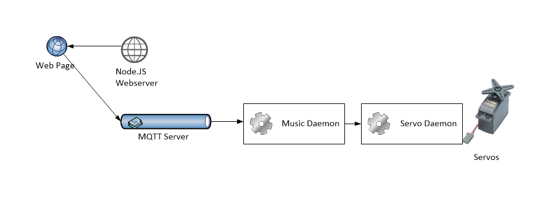

# Controller

## Overview

This demo project remote controls some servos from a web page

## Client Components

* Bootstrap - For styling
* Knockout - To bind the data to the controls on the page
* Socket.IO - To communicate with the sockets
* Paho MQ Client - To communicate with the MQ

## Server Components
* Mosca - An MQTT broker
* MQTT - The MQTT client for node
* queue - An async queue for node
* servoDaemon - A named pipes interface for the BeagleBone Blue's servos (uses API described at http://strawsondesign.com/#!manual-servos)

## Install
### Install Mosca
https://github.com/mcollina/mosca/wiki/Mosca-as-a-standalone-service.

### Install MQTT
https://www.npmjs.com/package/mqtt#install

### Install Queue
https://www.npmjs.com/package/queue

### Build and install ServoDaemon
1. Copy the files to the board
1. build.sh 
1. sudo createDaemon.sh 

## Using

Run Mosca with
 mosca -v --http-port 1884 --only-http

Run webserver with
./webServer.js

Run musicController with
./musicListener.js

Navigate to web page (don't use Edge)
http://beaglebone.lan:9090/controller.html

Connect to queue then press buttons 1-8 to see servos move
